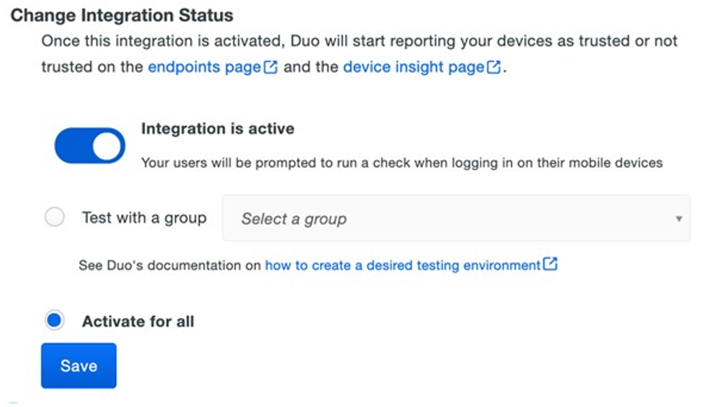

# Cisco Duo Connector Overview

The Microsoft Edge for Business connector works with Cisco Duo to strengthen security by enabling device trust verification without the need for additional agents. Simplify your security management with easy Duo implementation, ensuring secure application access and enhanced browser protections.

## Connector Setup and Configuration Steps

## Cisco Duo Configuration 

### Admin Portal Setup

#### Prerequisites   

- Access to the [Microsoft Entra Admin Center](https://entra.microsoft.com/#home)  
- Access to the [Microsoft 365 Admin Center](https://admin.microsoft.com/#/Edge)  
- Access to the Duo Admin Panel as an administrator with the Owner, Administrator, or Application Manager [administrative roles.](https://duo.com/docs/admin-roles)  
- Devices with Windows OS to be enrolled   

#### 1. Create the Edge Device Trust Connector Integration

1. Log in to the [*Duo Admin Panel](https://admin.duosecurity.com/login?next=%2F) and navigate to **Trusted Endpoints** under the **Devices** section.
2.	If this is your first management integration, click the **Get started** button at the bottom of the Trusted Endpoints introduction page. If you're adding another management integration, click the **Add Integration** button you see at the top of the page instead. 
3. On the "Add Management Tools Integration" page, locate **Microsoft Edge for Business Device Trust Connector** in the list of "Device Management Tools" and click the **Add this integration** selector. 
4. Choose **Windows** from the "Recommended" options, and then click the **Add** button.

The new Microsoft Edge for Business Device Trust Connector integration is created in the "Disabled" state. You'll turn it on when you're ready to apply your Duo trusted endpoints policy. If the Edge for Business Device Trust Connector trust check fails any active Duo Desktop based integrations will run a trust check as a fallback. 

During setup, keep the Duo Admin Panel open in your browser. You'll need to refer back to the Edge for Business Device Trust Connector integration page to complete the Microsoft Entra configuration steps. 

## Create A New App Registration in Microsoft Entra 

1.	Navigate to the [Microsoft Entra admin center](https://microsoft-onmicrosoft-com.access.mcas.ms/aad_login) > Applications > App registrations > New registration. 
2.	Register your new application. Allow access to “Accounts in any organizational directory (Any Microsoft Entra ID tenant – Multitenant)”.  
3.	Navigate to the newly created app registration. Use the left-side navigation, under “Manage”, to go to Certificates & Secrets. Create a new client secret for your application to be used in a later step. 
4.	In the left-side navigation, go to Manage > API Permissions. Configure the required permissions on your newly created app registration to give the application permissions to access the Device Trust API. 

- 4.1.	Search for the “Microsoft Edge management service” in the “APIs my organization uses” tab. Click on the resulting row. NOTE: If you don’t see the application, you will need to add it to your tenant.  

- 4.2 **If you can’t find the Microsoft Edge management Service in your tenant**  – You must add the application to your tenant to see it. Navigate to the Graph Explorer and sign in with your account. Once you’ve done so, copy the request shown and execute it (App ID is **ff846ae4-7ec9-42f4-8576eb14198ad5e1**). Ensure you grant the graph explorer permissions on the “Modify permissions” tab. After completing this step, you should see the Microsoft Edge management service in your tenant 

   

- 4.3.	Select “Application permissions” and add the “DeviceTrust.Read.All” permission. 

## Create a New Policy in Microsoft 365   

1. Log in to the Microsoft 365 Admin Center and navigate to the Settings -> Microsoft Edge page.   

2. Navigate to the “Configuration policies” tab, click “Create policy”.   

3. (Optional) After saving, click on your newly created policy, navigate to the “Group assignment” tab, and select a group that your policy will be assigned to.   

4. After creating a policy, navigate to the “Connectors” tab on the Microsoft Edge settings page and click on the “Set up” button under the Cisco Duo Device Trust connector.   

5. Search for the policy you’ve created in step 2 in the “Choose Policy“ dropdown and paste “https://duosecurity.com“ in the “URL patterns to allow”.    

6. Click the “Save configuration” button. You should now see the Cisco Duo Device Trust connector appear under the “Installed Connectors” section.   

## Register your Microsoft Entra Application with Duo   

1. Return to your Edge for Business Device Trust Connector management integration details page in the [Duo Admin Panel](https://admin.duosecurity.com/login?next=%2F). Scroll down to the section labeled **“Register Microsoft Entra Application with Duo”**.   

2. Enter the **Tenant ID, Client ID, and Client Secret** values from the application you created earlier.   

3. Click the **Test Configuration** button to verify your setup. If you do not receive a "Configuration Successful!" message, double-check that you provided the right application information.   

4. If testing your configuration was successful, click **Save & Configure**.  

## Finish Trusted Endpoints Deployment   

After creating the Edge for Business Device Trust Connector Trusted Endpoints integration, set the [Trusted Endpoints](https://duo.com/docs/policy#trusted-endpoints) policy to start checking for Edge for Business browser enrollment as users authenticate to Duo-protected services and applications.   

When your trusted endpoints policy is applied to your Duo applications, return to the Edge for Business   

Device Trust Connector [Trusted Endpoints] integration in the Admin Panel. The "Change Integration Status" section of the page shows the current integration status (disabled by default after creation). You can choose to either activate this integration only for members of a specified test group or groups, or activate for all users. 

   

#### Step-by-step Instructions

1. **Navigate to the Microsoft Admin Center**  
   Go to [https://admin.microsoft.com/Adminportal/Home#/Edge/Connectors](https://admin.microsoft.com/Adminportal/Home#/Edge/Connectors)

2. **Discover the Connector**  
   Under **Discover Connectors**, locate the **Cisco Duo Device Trust Connector** and select **Set up**.

3. **Select a Policy**  
   In the **Choose policy** field, select a policy appropriate for your connector configuration.

4. **Enter URL Patterns**  
   In the **URL patterns to allow, one per line** field, input the required URL patterns.

5. **Save the Configuration**  
   Select **Save configuration** to apply your changes.

  
