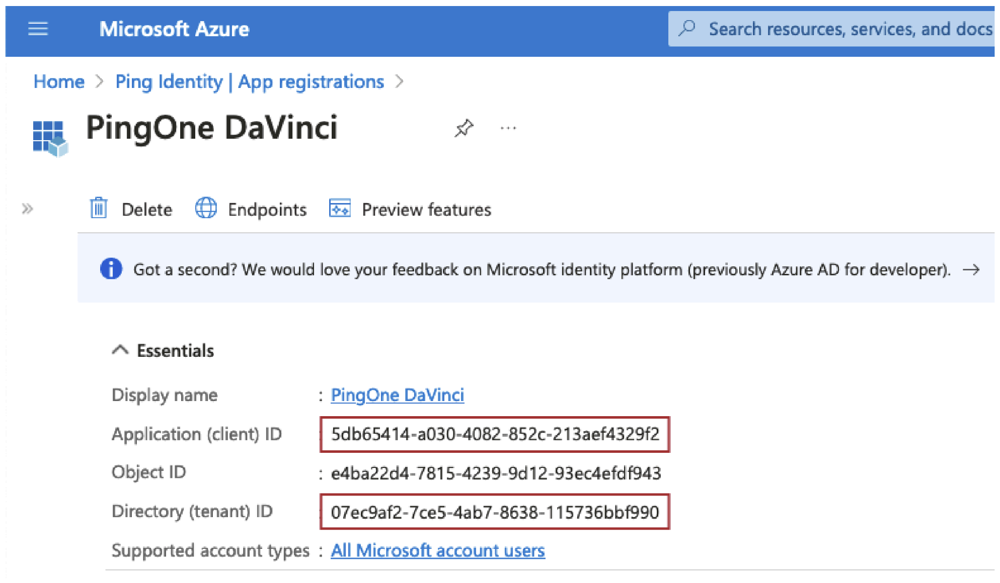
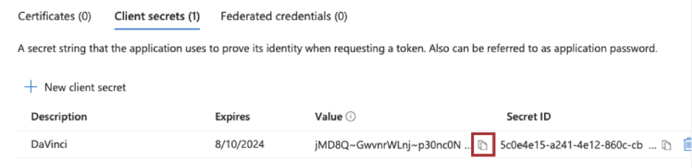
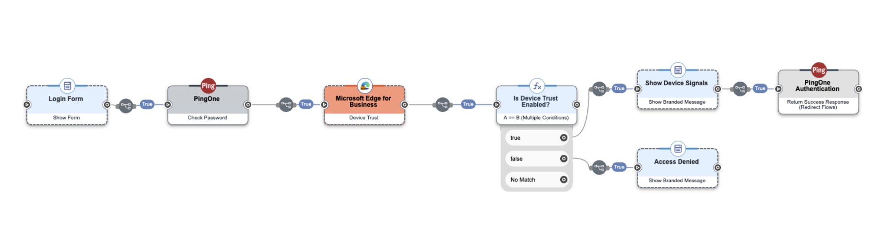

# Set up a PingOne DaVinci Connector

The Microsoft Edge for Business connector lets you use Microsoft Edge for Business to improve authentication security in your PingOne DaVinci flow.

Microsoft Edge for Business is a secure, high-performance browser built for enterprise needs, offering enhanced productivity, AI-powered features, and native integration with Microsoft 365—designed to protect corporate data while supporting modern workplace demands.

You can use the Microsoft Edge for Business connector to include operating system device signals collected by Microsoft Edge for Business in a PingOne DaVinci flow.

## Connector Setup and Configuration Steps

### Resources

For information and setup help, see these instructions:

- Microsoft Edge for Business documentation  
  https://www.microsoft.com/edge/business/?form=MA13FJ

- Register an application with the Microsoft identity platform

- DaVinci documentation:
  - Adding a connector
  - Using connectors securely
  - Using DaVinci flow templates

## Requirements

To use the Microsoft Edge for Business PingOne DaVinci connector, you must have access to register an application through Microsoft Entra and assigning it the required Device Trust permissions. As well, access to the Microsoft 365 admin center is required to configure the Microsoft Edge for Business Policies.

### Setting up Azure App Registration

1. Sign on to the Azure portal.
2. Create the application:
   - Search for and select Azure Active Directory.
   - Under Manage, select **App registrations** → **New registration**.
   - Register a new Application and select the newly registered application.
   - Configure the required permissions on the newly created App Registration to give the application permissions to access the Device Trust API.
   - Search for the **Microsoft Edge management service** in the *APIs my organization uses* tab.
   - Select **Application permissions** and add the `DeviceTrust.Read.All` permission.
   - Once added, select the **Grant admin consent** confirmation.
   - Select **Register**.

On your app’s Overview page, note the **Application (client) ID** and **Directory (tenant) ID**. You use these items in the connector configuration.

 

### Create a client secret:

- Under Manage, select **Certificates & secrets**. On the *Client secrets* tab, select **New client secret**.
- Enter a name and select an expiry time. Select **Add**.
- Note the **Value** of the secret. You use this item in the connector configuration.  

 

## Configure the Connector in the Microsoft Edge Management Service

1. Sign on to **Microsoft 365 admin center**.
   -   Admins must set up a configuration policy to assign to any Connector configuration. [Follow this guide to create a configuration policy](/deployedge/microsoft-edge-management-service?branch=pr-5295).
   - Once you have at least one configuration policy created, visit [the Connectors page in the Microsoft Edge Management Service](https://admin.microsoft.com/Adminportal/Home#/Edge/Connectors) to access the Connectors page in the Microsoft Edge Management Service.
2. Navigate to the **Microsoft Edge configuration**.
3. Navigate to the **Connectors** tab and select **Set up** under the **Ping Identity Device Trust** feature.
4. In the right panel put in the following PingOne DaVinci domains:
   - auth.pingone.com
   - auth.pingone.ca
   - auth.pingone.eu
   - auth.pingone.asia
   - auth.pingone.au

<!--[screenshot3 hypr edge API.](media/microsoft-edge-connectors-ping/3.png) -->

5. Select **Save Configuration**

The Microsoft Edge for Business Device Trust is now configured.

## Configuring the Microsoft Edge for Business connector

Add the connector in DaVinci then configure it as follows.

### Connector configuration

- **Azure Tenant ID**  
  The tenant ID of your Microsoft Azure Tenant.

- **Client ID**  
  The client ID you created in previous steps.

- **Client Secret**  
  The client secret you created in previous steps.

## Using the connector in a flow

### Device Trust

The Device Trust capability allows PingOne DaVinci to receive the Microsoft Edge for Business Device Signals which include the device attributes such as Serial Number, MAC Addresses, and Hostname. Also, the CrowdStrike agent ID is included if the CrowdStrike agent is installed.

See for an example of a PingOne DaVinci flow which blocks access to users who aren't using the expected Microsoft Edge for Business enrolled browser:

 

