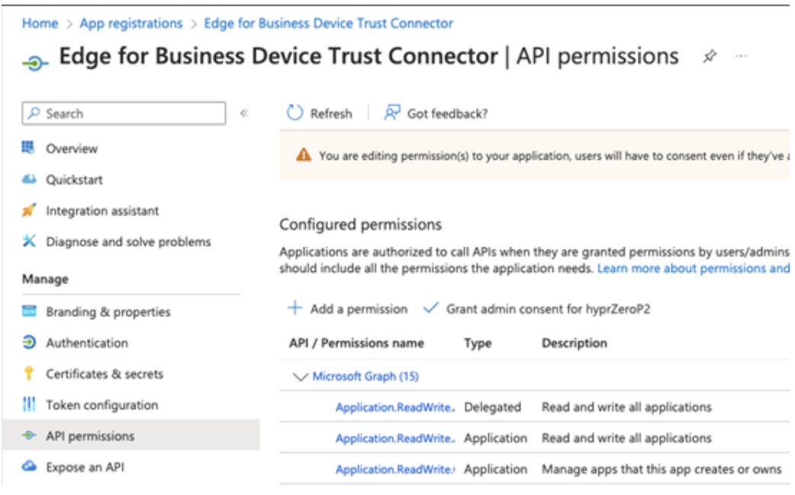
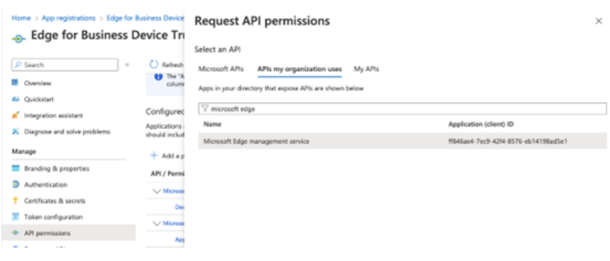
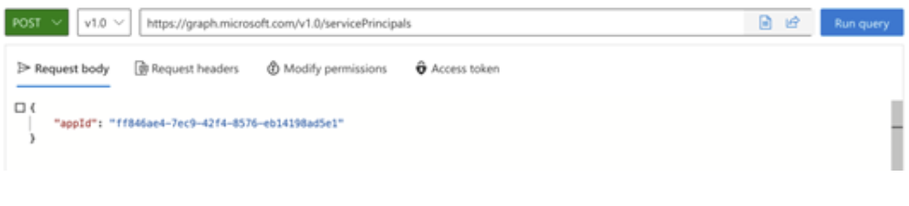
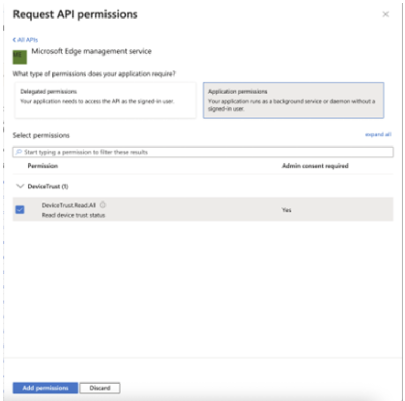
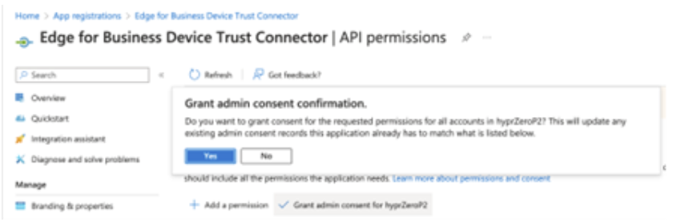
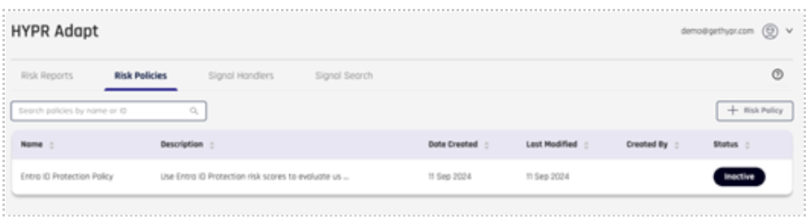
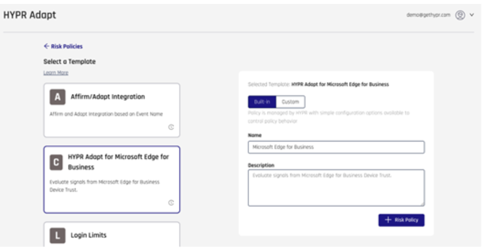
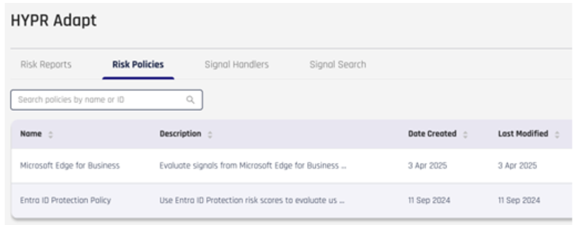
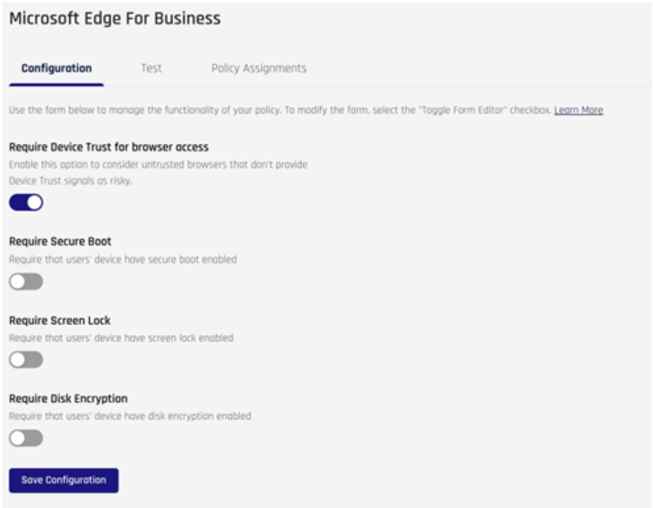

# Set up a HYPR Device Trust Connector 

HYPR Adapt integrates with Microsoft Edge for Business to enhance enterprise security by extending signal collection and exchange with corporate browsers. This integration strengthens data protection and enables a more comprehensive approach to risk evaluation by correlating context-aware signals across enterprise browsers, workstations, and mobile devices. 

By leveraging this integration, organizations can gain deeper visibility into user behavior, detect potential threats more effectively, and enforce security policies in real time. The seamless flow of contextual data between HYPR Adapt and Microsoft Edge for Business helps identify anomalous activities, unauthorized access attempts, and risky behavior, allowing enterprises to take proactive security measures. 

Additionally, this integration supports a unified security posture across various endpoints, reducing the attack surface and improving compliance with security standards and policies. With enhanced signal collection and correlation, businesses can make more informed security decisions, ultimately reducing risk and ensuring a safer digital workspace. 

## Prerequisites   

- Access to the Microsoft [Entra Admin Center](https://entra.microsoft.com/) 
- Access to the Microsoft [365 Admin Center](https://admin.microsoft.com/#/Edge)  
- HYPR Identity Assurance solution enabled and integrated with your Microsoft Entra ID tenant as the Identity Provide.   
- Ability to grant the HYPR registered application in Entra ID access permissions to the “Microsoft Edge management service.   

## 1. HYPR Device Trust Integration for Microsoft Edge for Business

### Integrate Entra ID with HYPR

The first step is to integrate Entra ID with your HYPR tenant. This allows access to your organization’s Entra ID-based applications using HYPR authentication as a phishing-resistant multi-factor authentication method.

You can find the complete steps to configure this integration in HYPR’s [Entra ID: External Authentication Method guide](https://www.hypr.com).

---

### Configure Edge for Business Device Trust Integration

Now that your Entra ID users are integrated with HYPR, you need to configure Edge for Business for the Device Trust integration. Perform the following steps through the Entra portal using an account with proper administrative permissions.

## 2. Grant API Permission to the HYPR Application  

1. From the [Entra ID](https://entra.microsoft.com) portal home screen, select **Entra ID** > **Applications** > **App registrations**, and choose the application you used to integrate with HYPR.

2. Select **API permissions**, then click **Add a permission**. 

<!--  --> 
  
3. Search for the “Microsoft Edge management service” in the **APIs my organization uses** tab, and click on the resulting row. 

<!-- -->

   If the Microsoft Edge management service isn't listed in your environment, you need to add it to your tenant. To do this, navigate to [Graph Explorer](https://developer.microsoft.com/en-us/graph/graph-explorer) and sign in with your account. Once signed in, copy the provided request and execute it (App ID: ff846ae4-7ec9-42f4-8576-eb14198ad5e1). 

   Make sure to grant Graph Explorer the necessary permissions under the **Modify permissions** tab. After completing these steps, the Microsoft Edge management service should appear in your tenant. 

<!-- -->

You can find more details about those steps in Microsoft’s [Create a service principal for an application guide](https://learn.microsoft.com/graph/tutorial-applications-basics?tabs=http#create-a-service-principal-for-an-application). 

4. **Select Application Permissions** and add the “DeviceTrust.Read.All” permission. 

<!--  -->

5. After adding it, grant admin consent for the tenant. 

<!-- -->

## 3. Configure the Connector in the Edge Management Service

1. **Navigate to the Microsoft Admin Center**  
   Go to [https://admin.microsoft.com/Adminportal/Home#/Edge/Connectors](https://admin.microsoft.com/Adminportal/Home#/Edge/Connectors)
   -   Admins must set up a configuration policy to assign to any Connector configuration. [Follow this guide to create a configuration policy](/deployedge/microsoft-edge-management-service?branch=pr-en-us-5295).
   - Once you have at least one configuration policy created, visit [the Connectors page in the Edge Management Service](https://admin.microsoft.com/Adminportal/Home#/Edge/Connectors) to access the Connectors page in the Edge Management Service.

2. **Discover the Connector**  
   Under **Discover Connectors**, locate the **HYPR Device Trust Connector** and select **Set up**.

3. **Select a Policy**  
   In the **Choose policy** field, select a policy appropriate for your Connector configuration.

4. **Enter URL Patterns**  
   In the **URL patterns to allow, one per line** field, input the URL for your configuration.

5. **Save the Configuration**  
   Select **Save configuration** to apply your changes.
 
## 4. Create and Assign a HYPR Adapt Risk Policy

The final step is to create a HYPR Adapt risk policy to evaluate Microsoft Edge for Business Device Trust signals.

1. Contact HYPR Support to ensure that the HYPR Adapt for Microsoft Edge for Business integration is available and enabled on your tenant. 

2. Access HYPR Control Center and navigate to **HYPR Adapt**. At the top right of the Risk Policies list, select **+ Risk Policy**. 

<!-- -->

3. Select the **HYPR Adapt for Microsoft Edge** for Business policy and provide a **Name** and a **Description**, if desired. 

<!-- -->

4. Your policy will now appear in the Risk policies list. 

<!-- -->

5. You can configure your policy as needed by clicking on **Configuration**. When satisfied with the settings, click **Save Configuration**. 

<!-- -->

6. Finally, assign the policy to your Entra ID integration. Follow the [Policy Assignments](https://docs.hypr.com/docs/adapt/adaptInstallCfg/adaptInstallCfgRiskPolicies/adapt-install-cfg-risk-policies/#policy-assignments) guide in HYPR’s documentation for more details.

The default risk policy includes a few basic checks that can serve as a baseline, allowing you to tailor it further to match your security policies and requirements. 

---

## Test the User Flow

Finally, you can test the user flow by selecting one of the users assigned in the Edge policy. 

On a supported Microsoft Edge installation that is part of the tenant and group you configured the policy for, navigate to edge://policy and click the **Reload Policies** button. You should see the policy appear in the list, containing the HYPR tenant URL. 

From that Microsoft Edge for Business browser session, sign in to your Entra ID resources and select the HYPR authentication method. You should be redirected to the HYPR login page, where the Device Trust signals will be evaluated according to your configuration. 
