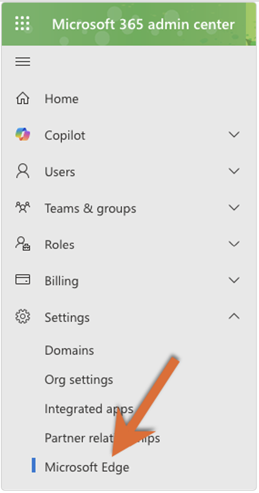
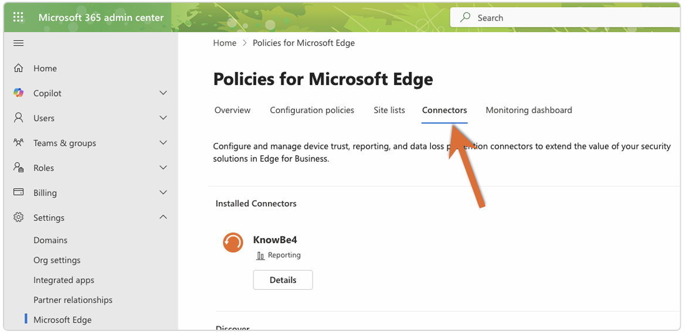
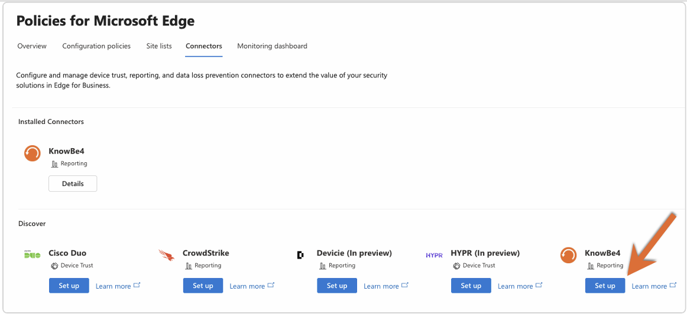
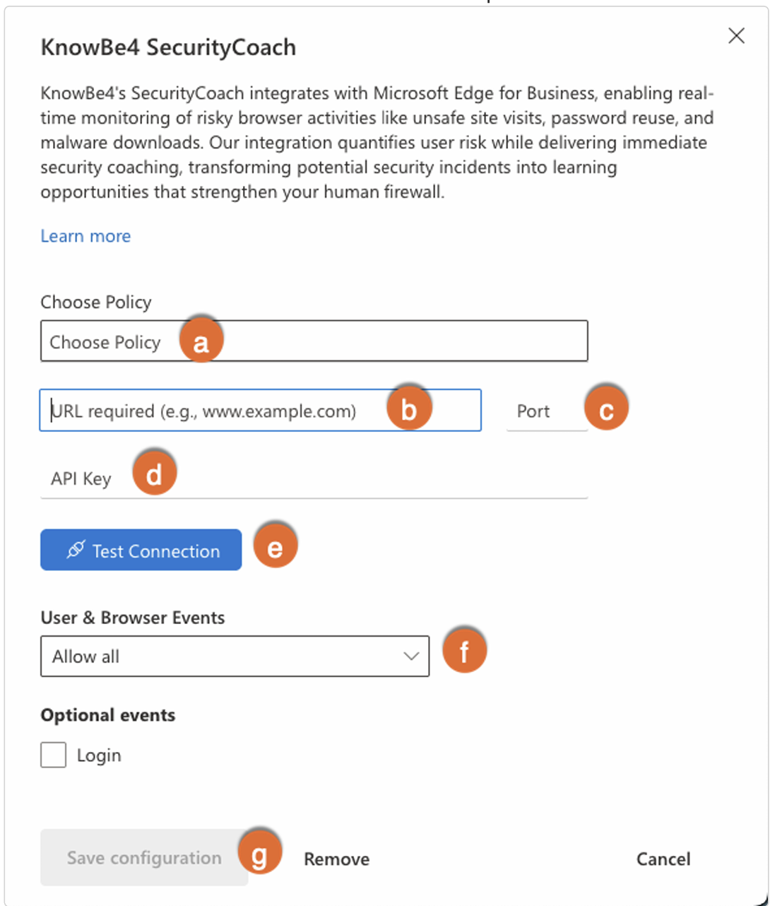
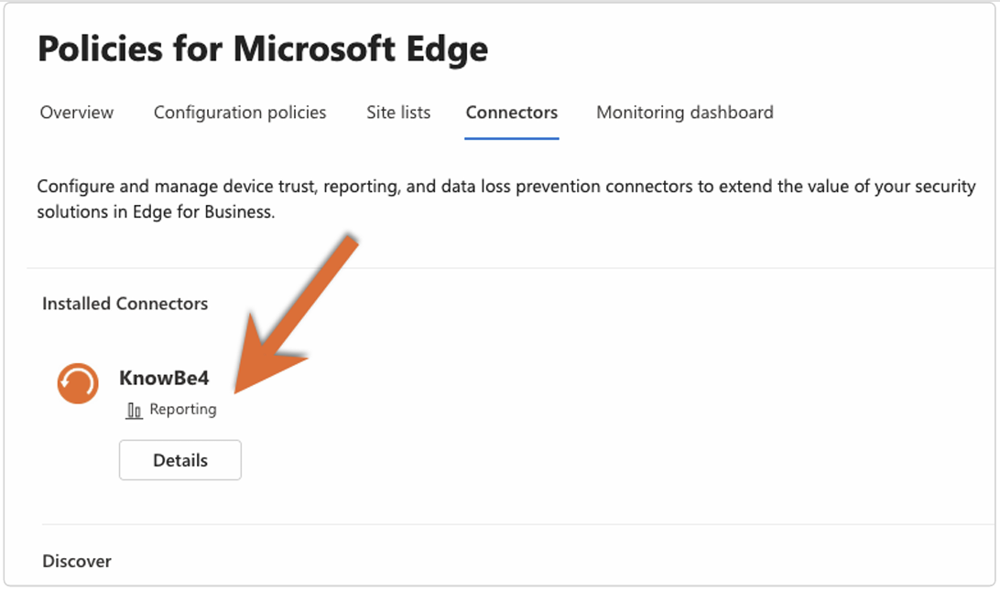

# Microsoft Edge for Business Integration Guide for SecurityCoach

In this article, you’ll learn how to integrate Microsoft Edge for Business with SecurityCoach. Once the integration is complete, data provided by Microsoft Edge for Business will be available under the **SecurityCoach** tab of your KnowBe4 console. You can view this data in your SecurityCoach reports and use it to create detection rules for your real-time coaching campaigns.

For more information, see our [SecurityCoach Product Manual](https://support.knowbe4.com/hc/en-us/articles/6654432814355-SecurityCoach-Product-Manual).

> **Important:** To configure the Microsoft Edge for Business integration, you'll need access to a Microsoft 365 administrator account.

---

## Setting Up the Integration in SecurityCoach
To set up the Microsoft Edge for Business integration in SecurityCoach, follow these steps:

1. Log in to your KnowBe4 console.
2. Navigate to **SecurityCoach > Setup > Security Vendor Integrations**.
3. Locate the **Microsoft Edge for Business** vendor tile and click **Configure**. The Microsoft Edge for Business integration page will open.
  
4. Click **Enable Integration** to enable the integration in SecurityCoach and generate your **Organization Key**.
 
5. Copy and save your **Organization Key**. You’ll need it in the next section.
 

> **Note:** Events from Microsoft Edge for Business are automatically mapped to users using their usernames.

---

## Setting Up the Integration in Microsoft 365
To set up the Microsoft Edge for Business integration in your Microsoft 365 account, see the sections below.

### Setting Up a Business Policy in Microsoft 365

1. Log in to your Microsoft 365 admin center.
2. From the left navigation menu, go to **Settings > Microsoft Edge**.
 
3. In the new tab, go to the **Configuration policies** subtab.
 
4. Click **Create Policy**.
 
5. In the **Basics** section, fill in the required details:
 
   - **Name:** Enter your preferred policy name.
   - **Description:** Enter your preferred description.
   - **Policy type:** Select **Cloud** from the dropdown menu.
6. In the **Settings** section, click **Add setting** and add the following:
   - `SmartScreenEnabled`
   - `PasswordProtectionLoginURLs`  
     > **Important:** You must first configure your preferred URLs. [See Microsoft’s documentation](/deployedge/microsoft-edge-browser-policies/passwordprotectionloginurls).
   - `PasswordProtectionWarningTrigger`
7. In the **Extensions** section, use the default settings and click **Next**.
8. In the **Assignments** section, either:
   - Use **Select group** to add specific groups, or
   - Choose **Add all users**. Then click **Next**.
9. In the **Finish** section, review your settings and click **Review and create**.

---

### Setting Up Reporting in Microsoft 365

1. Log in to your Microsoft 365 admin center.
2. From the navigation menu on the left side of the screen, navigate too **Settings > Microsoft Edge**.
 
3. In the new tab, go to the **Connectors** subtab.
 
4. Navigate to **Discover > KnowBe4 > Set up**. A new **KnowBe4 SecurityCoach** window will appear.
 
5. Fill in the required fields:
 

   - **Choose Policy:** Select the policy configured in the previous step.
   - **URL Field:** Use the URL that matches your KnowBe4 instance:

     | KnowBe4 Instance     | URL                                                       |
     |----------------------|------------------------------------------------------------|
     | United States        | `https://msedge.vendor.training.knowbe4.com/v1/webhook/msedge` |
     | European Union       | `https://msedge.vendor.eu.knowbe4.com/v1/webhook/msedge`     |
     | Canada               | `https://msedge.vendor.ca.knowbe4.com/v1/webhook/msedge`     |
     | United Kingdom       | `https://msedge.vendor.uk.knowbe4.com/v1/webhook/msedge`     |
     | Germany              | `https://msedge.vendor.de.knowbe4.com/v1/webhook/msedge`     |

   - **Port Field:** Enter `443`.
   - **API Key Field:** Enter the **Organization Key** you copied earlier in the
 Setting Up the Integration in SecurityCoach section of this article.
   - **Test Connection:** Click to verify the connection (required).
   - **User & Browser Events:** Select **Allow selected events** and ensure the following are enabled:
     - Unsafe Site Visit
     - Malware Transfer
     - Password Reuse
     
     > **Tip:** These User & Browser Events enabled are supported by
 [SecurityCoach system detection rules](https://support.knowbe4.com/hc/en-us/articles/11167145735955-System-Detection-Rules-by-Vendor). To coach your users on
 additional User & Browser Events, first enable the additional
 events, then create associated custom detection rules in
 SecurityCoach. For more information, see our [Detection Rules Guide](https://support.knowbe4.com/hc/en-us/articles/7159083016723-Detection-Rules-Guide).

   - **Save Configuration:** Click to save the integration.

6. The saved connector will appear in the **Connectors** subtab under **Installed Connectors**.
 

---

## Deleting the Integration in SecurityCoach

If you need to delete the integration, follow these steps:

1. Log in to your KnowBe4 console.
2. Go to **SecurityCoach > Setup > Security Coach Vendor Integrations**.
3. Locate the **Microsoft Edge for Business** vendor tile and click **Edit**.
4. Click **Delete Integration** at the bottom.
5. In the pop-up window, click **Confirm** to delete the integration.

  

