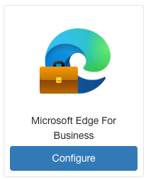
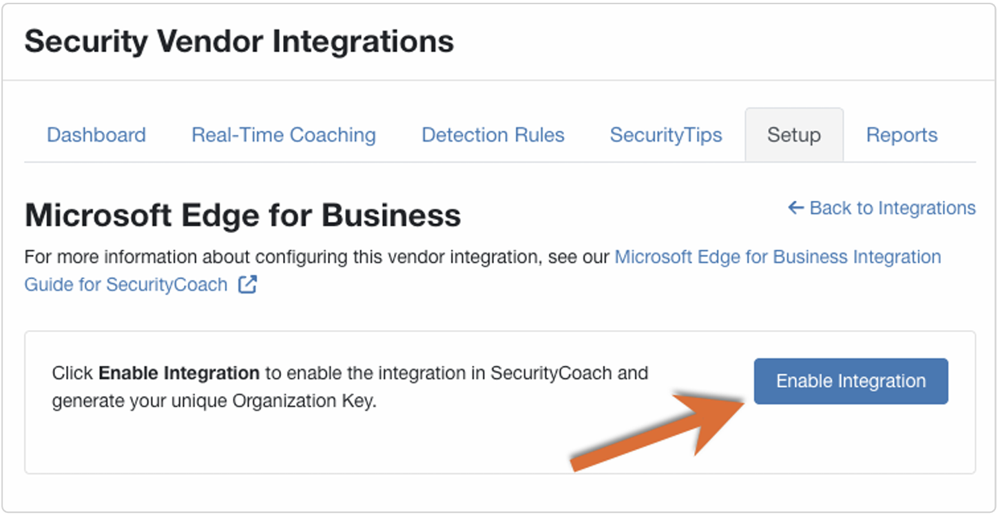
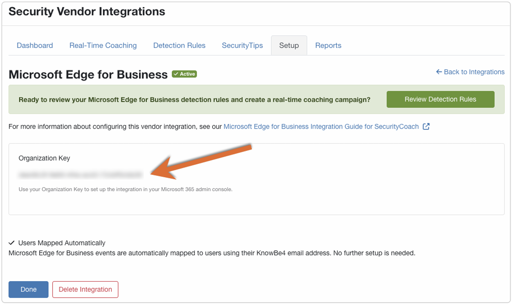
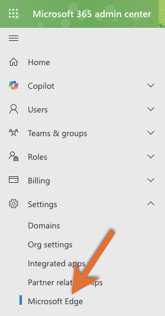
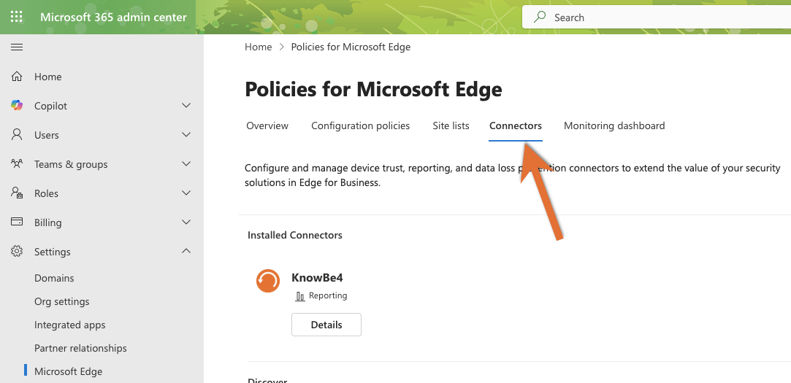
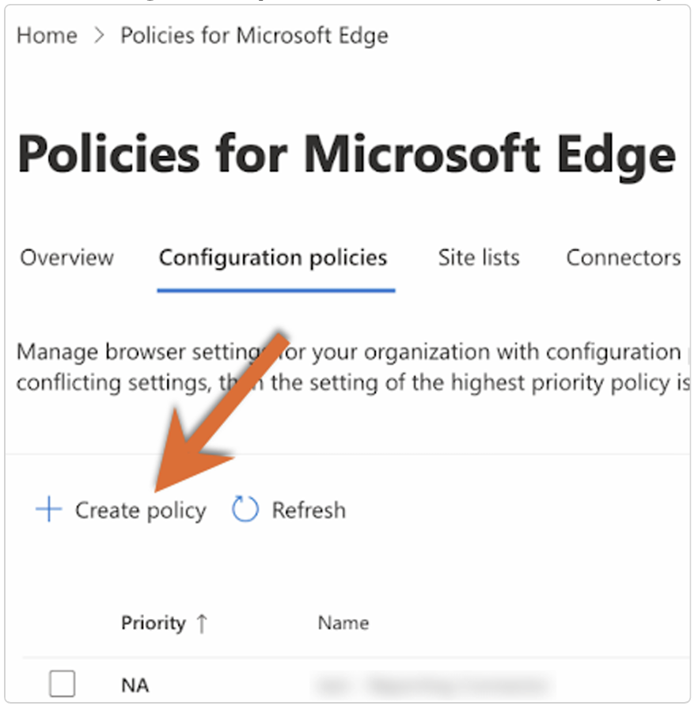
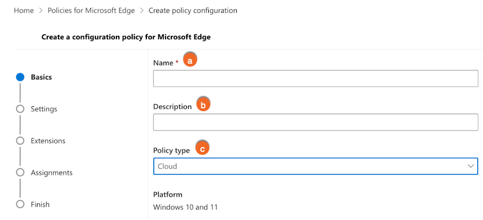
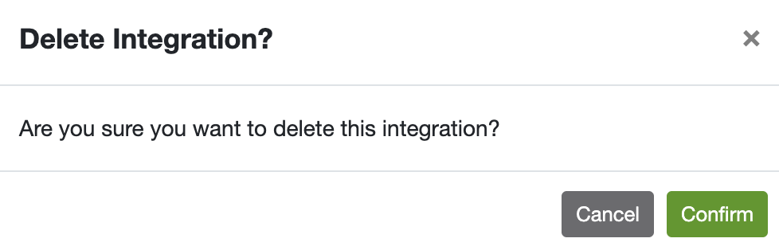

# Set up a KnowBe4 Connector

In this article, you’ll learn how to integrate Microsoft Edge for Business with SecurityCoach. Once the integration is complete, data provided by Microsoft Edge for Business will be available under the **SecurityCoach** tab of your KnowBe4 console. You can view this data in your SecurityCoach reports and use it to create detection rules for your real-time coaching campaigns.

For more information, see our [SecurityCoach Product Manual](https://support.knowbe4.com/hc/en-us/articles/6654432814355-SecurityCoach-Product-Manual).

> **Important:** To configure the Microsoft Edge for Business integration, you'll need access to a Microsoft 365 administrator account.

---

## Setting Up the Integration in SecurityCoach
To set up the Microsoft Edge for Business integration in SecurityCoach, follow these steps:

1. Log in to your KnowBe4 console.
2. Navigate to **SecurityCoach > Setup > Security Vendor Integrations**.
3. Locate the **Microsoft Edge for Business** vendor tile and click **Configure**. The Microsoft Edge for Business integration page will open.  
4. Click **Enable Integration** to enable the integration in SecurityCoach and generate your **Organization Key**.
 
5. Copy and save your **Organization Key**. You’ll need it in the next section.
 

> **Note:** Events from Microsoft Edge for Business are automatically mapped to users using their usernames.

---

## Setting Up the Integration in Microsoft 365
To set up the Microsoft Edge for Business integration in your Microsoft 365 account, see the sections below.

### Setting Up a Business Policy in Microsoft 365

1. Log in to your Microsoft 365 admin center.
2. From the left navigation menu, go to **Settings > Microsoft Edge**.
 
3. In the new tab, go to the **Configuration policies** subtab.
 
4. Click **Create Policy**.
 
5. In the **Basics** section, fill in the required details:
 
   - **Name:** Enter your preferred policy name.
   - **Description:** Enter your preferred description.
   - **Policy type:** Select **Cloud** from the dropdown menu.
6. In the **Settings** section, click **Add setting** and add the following:
   - `SmartScreenEnabled`
   - `PasswordProtectionLoginURLs`  
     > **Important:** You must first configure your preferred URLs. [See Microsoft’s documentation](/deployedge/microsoft-edge-browser-policies/passwordprotectionloginurls).
   - `PasswordProtectionWarningTrigger`
7. In the **Extensions** section, use the default settings and click **Next**.
8. In the **Assignments** section, either:
   - Use **Select group** to add specific groups, or
   - Choose **Add all users**. Then click **Next**.
9. In the **Finish** section, review your settings and click **Review and create**.

---

## Configure the Connector in the Microsoft Edge Management Service

1. Navigate to [Microsoft Admin Center](https://admin.microsoft.com/Adminportal/Home#/Edge/Connectors).
   -   Admins must set up a configuration policy to assign to any Connector configuration. [Follow this guide to create a configuration policy](/deployedge/microsoft-edge-management-service).
   - Once you have at least one configuration policy created, visit [the Connectors page in the Microsoft Edge Management Service](https://admin.microsoft.com/Adminportal/Home#/Edge/Connectors) to access the Connectors page in the Microsoft Edge Management Service.

2. Under **Discover Connectors**, find the **KnowBe4 Reporting Connector** and select **Set up**.

3. In the **Chosen policy** field, select a policy for your Connector configuration.

4. Enter the following fields:
   - **Host address**
   - **Port**
   - **Token ID**

5. Select **Test Connection** to confirm the Connection is successful.

6. Under **User & Browser events**, select the desired browser events to be sent to the Devicie endpoint.

7. Select the desired **Optional events** and **Devices events**.

8. Select **Save configuration**.

---

## Deleting the Integration in SecurityCoach

If you need to delete the integration, follow these steps:

1. Log in to your KnowBe4 console.
2. Go to **SecurityCoach > Setup > Security Coach Vendor Integrations**.
3. Locate the **Microsoft Edge for Business** vendor tile and click **Edit**.
4. Click **Delete Integration** at the bottom.
5. In the pop-up window, click **Confirm** to delete the integration.

  

