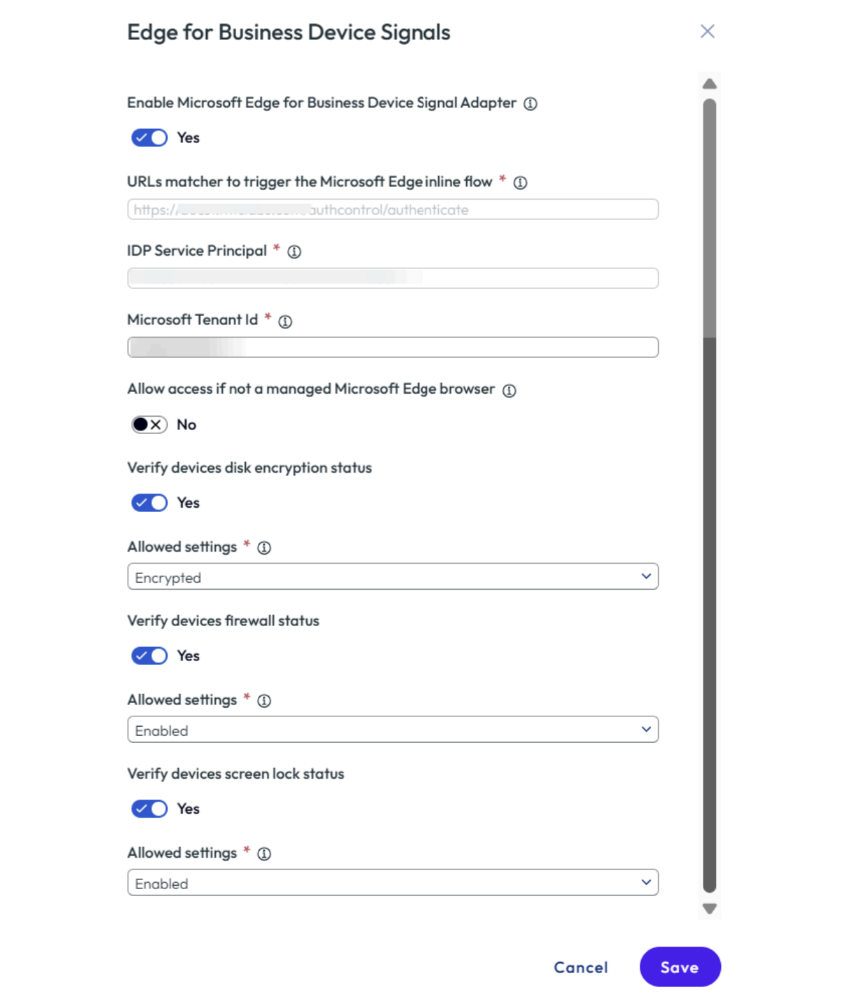

# Set up an Omnissa Device Trust Connector 

Device Trust Connector in Edge for Business signals make it possible to verify the  posture of an unmanaged device or a third-party managed device prior to allowing  access to company resources. A managed Edge web browser can collect information  about the security posture of a device and share it with Omnissa Access so that a  posture-informed access decision can be made in real time. 

 The verification of unmanaged devices prior to granting access to apps and resources is  simplified via the Omnissa integration within the Microsoft Trust Connector in  Edge for Business and an authentication adapter within Omnissa Access. Within  Omnissa Access, Device conditional access rules can be created that require specific device  signal criteria to be met. 

 You can configure Microsoft Edge for Business Device Signals as an authentication  factor in Omnissa Access to support authentication for managed policy on Windows  devices. You enable and configure the adapter in the Omnissa Access console to  retrieve device-level signals from the Edge browser. Users can sign in to Omnissa  Access from an Edge browser with a managed policy on a Windows machine. 

 The Edge for Business Device Signals authentication is based on the device signal  attributes that you enable when you configure the adapter in the Omnissa Access  console. You must also integrate Omnissa Access with the Microsoft Edge Device Trust  connector in the Microsoft Edge management service console. After completing the  setup in both the Omnissa and Microsoft consoles, you configure access policy rules in  the Omnissa Access console. 
 
 When users use the Edge browser to sign in, after their initial credentials are  authenticated, the second-factor authentication through Edge checks the device  security status based on the device signal attributes that you configured. Omnissa  Access retrieves the signal status from the Edge integration. 
 Edge for Business Device Signals authentication is available for users running the Edge  browser with a managed policy on Windows devices. 
 
 **Note : This authentication method is not available for managed browsers.**

## Prerequisites
- Omnissa Access SaaS tenant
- Microsoft Entra tenant ID
- Managed policy files
- Subscription plan:
  - Education: Microsoft 365 A3, A5
  - Business: Microsoft 365 Business Standard, Premium
  - Enterprise: Office 365 E3, E5, Microsoft 365 E3, E5

## Set Up Edge for Business Device Signals Adapter in Omnissa Access

### 1. Enable the Adapter
- Navigate to: **Omnissa Access Console > Integrations > Authentication Methods**
- Select: **Edge for Business Device Signals**
- Click **Configure**

### 2. Configuration Fields
| Option | Description |
|--------|-------------|
| Enable Microsoft Edge for Business Device Signal Adapter | Set to **Yes** to enable |
| URLs matcher to trigger Microsoft Edge inline flow | Copy and save this URL for use in the Edge management service |
| IDP Service Principal | Copy and save this value for the Edge management service |
| Microsoft Tenant ID | Enter your Microsoft Entra ID tenant ID |
| Allow access if not a managed Microsoft Edge browser | This setting is deactivated by default to prevent access from browsers without a managed policy. Activating this setting is not recommended. If support for unmanaged browsers is required, configure an alternative authentication method that provides strong validation as fallback. |
| Verify device's disk encryption status | Enable this setting to require device disk encryption. When multiple options are selected, validation uses OR logic.   • **Encrypted**: Main disk must be encrypted.   • **Encrypted \| Unspecified**: Main disk is encrypted or Edge did not send the signal.   • **Encrypted \| Unknown**: Main disk is encrypted or Edge could not evaluate the state.   • **Encrypted \| Unspecified \| Unknown**: Any of the above conditions is valid. |
| Verify device's firewall status       | Enable this setting to require a firewall. Validation passes if any selected condition is met.   • **Enabled**: Firewall is enabled.   • **Enabled \| Unspecified**: Firewall is enabled or Edge did not send the signal.   • **Enabled \| Unknown**: Firewall is enabled or Edge could not determine the status.   • **Enabled \| Unspecified \| Unknown**: Any of the above conditions is valid. |
| Verify device's screen lock status   | Enable this setting to require screen lock with a password. Validation passes if any selected condition is met.   • **Enabled**: Screen lock is enabled.   • **Enabled \| Unspecified**: Screen lock is enabled or Edge did not send the signal.   • **Enabled \| Unknown**: Screen lock is enabled or Edge could not determine the status.   • **Enabled \| Unspecified \| Unknown**: Any of the above conditions is valid. |

  

### 3. Click **Save**
- Your Omnissa configuration is now complete. Saving will generate the values needed to connect with Microsoft Edge.

### 4. Next Steps
- Copy the **URL matcher** and **IDP Service Principal**
- Use them to configure the Edge Device Trust Connector in the Microsoft Edge management console

## Integrate with Microsoft Edge Management Console
The Microsoft Edge Device Trust Connector must be configured to receive signals from Edge and share them with Omnissa Access.

1. **Navigate to the Microsoft Admin Center**  
   Go to [https://admin.microsoft.com/Adminportal/Home#/Edge/Connectors](https://admin.microsoft.com/Adminportal/Home#/Edge/Connectors)
   -   Admins must set up a configuration policy to assign to any Connector configuration. [Follow this guide to create a configuration policy](https://review.learn.microsoft.com/en-us/deployedge/microsoft-edge-management-service?branch=pr-en-us-5295).
   - Once you have at least one configuration policy created, visit [the Connectors page in the Edge Management Service](https://admin.microsoft.com/Adminportal/Home#/Edge/Connectors) to access the Connectors page in the Edge Management Service.

2. **Discover the Connector**  
   Under **Discover Connectors**, locate the **Omnissa Device Trust Connector** and select **Set up**.

3. **Select a Policy**  
   In the **Choose policy** field, select a policy appropriate for your Connector configuration.

4. **Enter URL Patterns**  
   In the **URL patterns to allow, one per line** field.

5. **Provide Consent for the IDP Service Principal**
   In the **Application (client) ID** field, enter the IDP Service Principal and select **Consent** to grant Omnissa access to retrieve device signals.

6. **Save the Configuration**  
   Select **Save configuration** to apply your changes.

## Add Device Signals as a Secondary Authentication Method

### 1. Link Method to Identity Provider
- Go to: **Omnissa Access Console > Integrations > Identity Providers**
- Select the Identity Provider
- Enable: **Microsoft Edge for Business Device Signals** under Authentication Methods
- Click **Save**

### 2. Add to Access Policy
- Go to: **Resources > Policies**
- Add or edit a policy
- Click **Next** to open Configuration
- Create or edit a rule:

| Field | Description |
|-------|-------------|
| If user's network range is | Select network range |
| and user accessing content from | Select **Windows 10+** |
| and user belongs to groups | Choose target group (or leave blank for all users) |
| Then perform this action | Require authentication using selected methods |
| then the user may authenticate using | Select primary authentication method |
| ADD AUTHENTICATION | Select **Microsoft Edge for Business Device Signals** as the secondary method |

Click **Next** and then **Save**.

### 3. Authentication Flow
- User signs in with primary authentication
- Edge checks device security status using configured signals
- Omnissa Access approves/denies access based on compliance

## Audit and Reporting
- Go to: **Monitor > Reports** in Omnissa Access Console
- Select **Audit Events** report type
- Configure parameters and click **Show Results**
- Report logs include signal status and authentication success/failure
