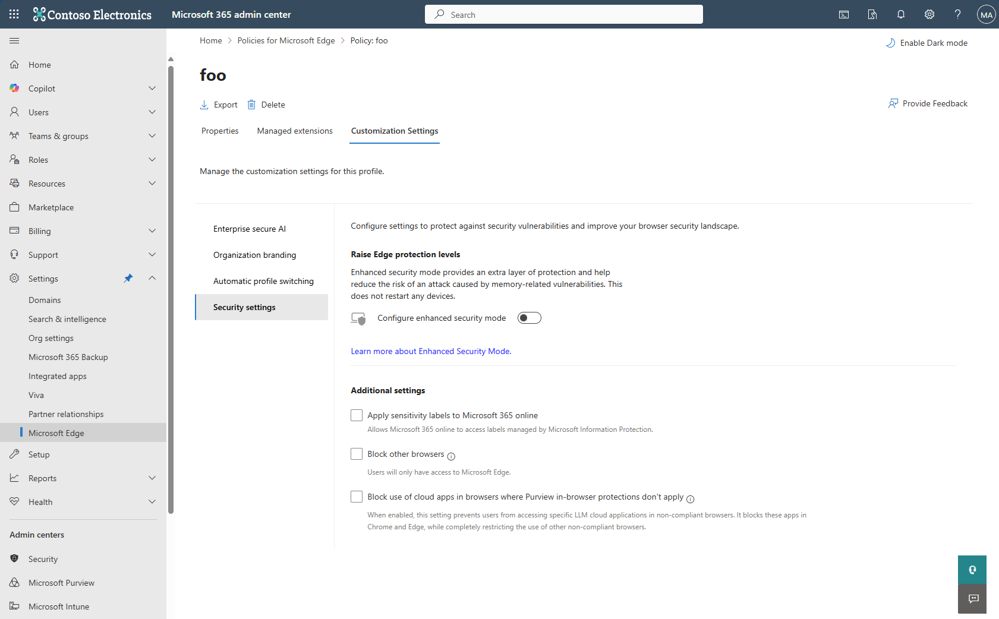
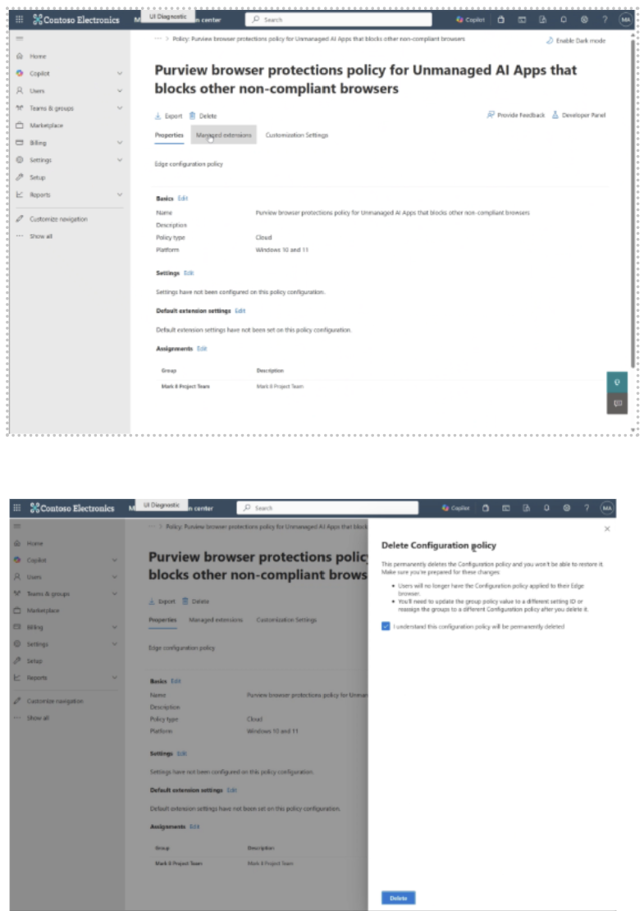
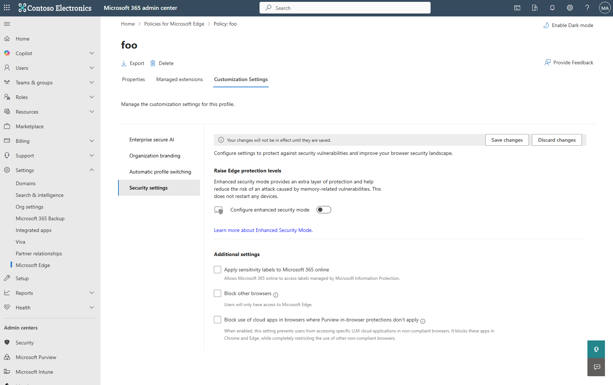

# Activate your DLP policy in Microsoft Edge

After you create a DLP policy in Purview, you must turn on the appropriate settings in Microsoft Edge to guarantee users in the policy can’t avoid the protections that block them from using noncompliant browsers.

[Learn more about how to turn on Microsoft Edge settings for users in a policy.](/deployedge/microsoft-edge-management-service)

> [!IMPORTANT]
> As a prerequisite, create a DLP policy in Purview before you turn on any settings in Microsoft Edge.

---

## Step 1: Set up an Edge Management Service

To successfully implement a Purview DLP policy that targets cloud apps, you must also set up an Edge Management Service that blocks noncompliant browsers.

1. Go to the [Microsoft 365 admin center](https://admin.microsoft.com/Adminportal/Home#/homepage).
2. Sign in and select **Settings** > **Microsoft Edge**.

---

## Step 2: Create a configuration policy for Microsoft Edge

Create a new configuration policy.

> [!IMPORTANT]
> Make sure to follow these guidelines.

- For **policy type**, choose “Cloud policy.”
- Include the same users scoped in the DLP policy.
- Settings aren’t required.
- You don’t need to modify the dropdown.
- Add security groups or all users in the tenant.

Click **Save**.

---

## Step 3: Turn on Microsoft Edge settings

Once you’ve created a configuration policy, turn on the settings that guarantee users can’t avoid the protections blocking them from using noncompliant browsers.

To turn on these settings:

1. In the newly created policy, select the **Customization Settings** tab.

> [!TIP]
> Anytime you edit settings in this tab, they'll show up in the “Settings” page on the left.

2. Select **Security settings**.
3. Check the box titled **“Block set domains where Purview in-browser protections don’t apply.”**

> [!NOTE]
> This ensures that when a user signs in to Microsoft Edge for Business on a new device using their EntraID credentials, the Purview DLP policies are automatically applied to that device.

Click **Save changes**.

---

## Delete the configuration policy with the Purview DLP policies

If you’re an admin, you can delete the configuration policy that was deployed to users or uncheck the “Block set domains” box.

### To delete the configuration policy:

1. Go to the policy.
2. Click **Delete**.
3. In the side panel, acknowledge and confirm the changes.
4. Click **Delete**.

---

### To uncheck the “Block set domains” box:

1. Go to the policy.
2. Select the **Customization Settings** tab.
3. Select **Security settings**.
4. Uncheck the box titled **“Block set domains where Purview in-browser protections doesn’t apply.”**

---

## FAQs

### Will my other settings still work if I check the “Block set domains” box?

No, the **“Block set domains”** box takes precedence over all other settings. Only one setting can be turned on at a time.

### Can I use manual and automated configurations with this new feature?

Yes, the magic button lets you configure semi-automatically. To do this, admins must disable existing policies.

<!-- ====================================================================== -->
## See also

- [Microsoft Edge Enterprise landing page](https://aka.ms/EdgeEnterprise)
