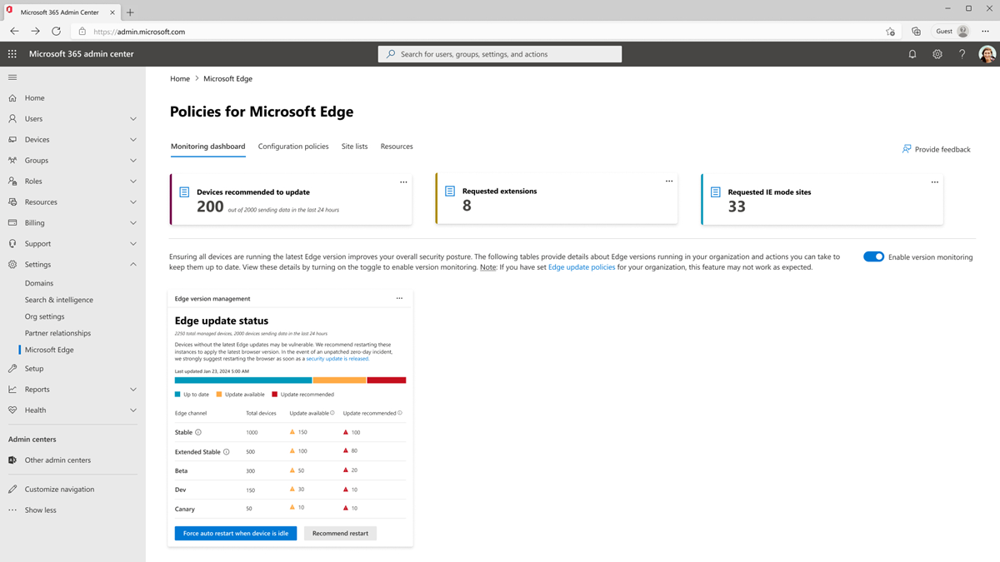

# Monitoring dashboard (in preview)

The monitoring dashboard gives you a snapshot of information about managed devices in your organization.

> [!NOTE]
> This experience is currently in preview. You can opt in to this preview by navigating to **Settings** > **Org settings** > **Organization profile** > **Release preferences**, and selecting a targeted release option.

## Enabling version monitoring

To view device insights on this page, you must first turn on the toggle to **Enable version monitoring**. This is a mandatory step to ensure that Microsoft Edge receives the necessary diagnostic data to keep the browser secure, up to date, and performing as expected. You can choose the following options for the amount data you would like to send:

- **Send required diagnostic data only:** This option sets the [DiagnosticData](/deployedge/microsoft-edge-policies#diagnosticdata) policy on your tenant-level to send required diagnostic data but turn off optional diagnostic data collection.

- **Send optional diagnostic data without URL data:** This option sets the [DiagnosticData](/deployedge/microsoft-edge-policies#diagnosticdata) policy on your tenant-level to send optional diagnostic data for better product and service improvement. It also disables the [UrlDiagnosticDataEnabled](/deployedge/microsoft-edge-policies#urldiagnosticdataenabled) policy to not send data about page URLs and per-page usage.

- **Send optional diagnostic data with URL data:** This option sets the [DiagnosticData](/deployedge/microsoft-edge-policies#diagnosticdata) policy on your tenant-level to send optional diagnostic data for better product and service improvement. It also enables the [UrlDiagnosticDataEnabled](/deployedge/microsoft-edge-policies#urldiagnosticdataenabled) policy to send data about page URLs and per-page usage to help make browsing and search better.

## Edge update status

Browser sessions without the latest security updates might be at risk. The Edge update status card provides insight into the different versions of Edge that are in use across your managed devices and provides actions to help keep them up to date with the latest version. This card allows you to see the number of devices that are running across each Edge channel and whether those devices are up to date, have an update available, or are recommended to update. The following information is provided for your devices:

- The **Total devices** column displays the number of managed devices that are running across each Edge channel.

- The **Update available** column displays the number of managed devices that aren't running the latest version across each Edge channel.

- The **Update recommended** column displays the number of managed devices that are running a version that is two or more releases behind across each Edge channel.

For devices that are out of date, you can choose one of the following actions to keep those browsers up to date.

- **Force auto restart when device is idle:** This action automatically restarts the users' browsers to apply the latest update when their device is detected as idle. Users are notified, and their tabs will be restored. The current idle period is defined as 20 minutes of no user input. **Note:** This may cause loss of content input.

- **Recommend restart:** This action sends a notification to the user to restart their browser to apply the latest update. No action will be taken on their behalf, and users may choose whether to act upon the notification.

For either of the previous actions, you can choose whether you would like to perform this action on only the devices that have an update recommended, or all devices that are out of date. **Note:** After the action is completed, it may take up to 90 minutes for the user to receive the update notification on their device.

## See also

[Microsoft Edge management service](/deployedge/microsoft-edge-management-service)
