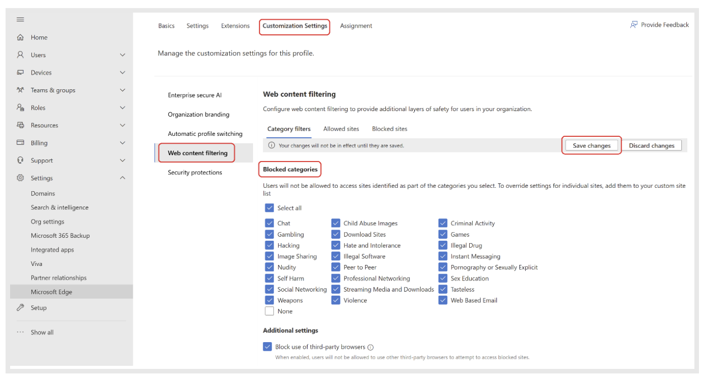
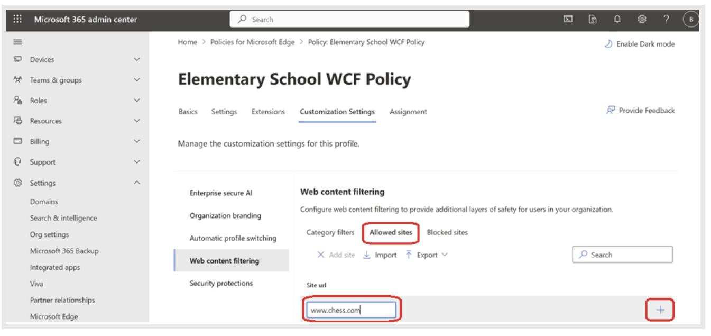
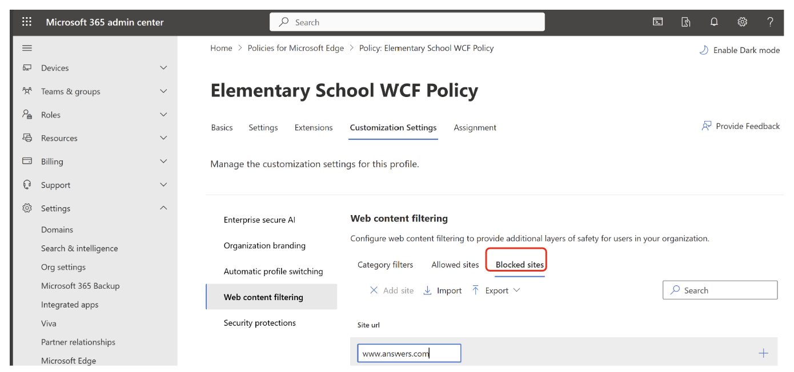
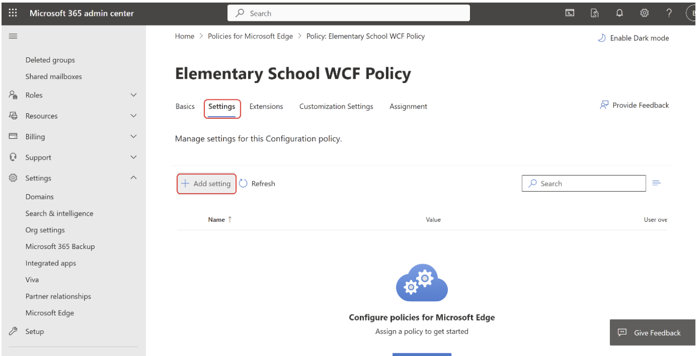
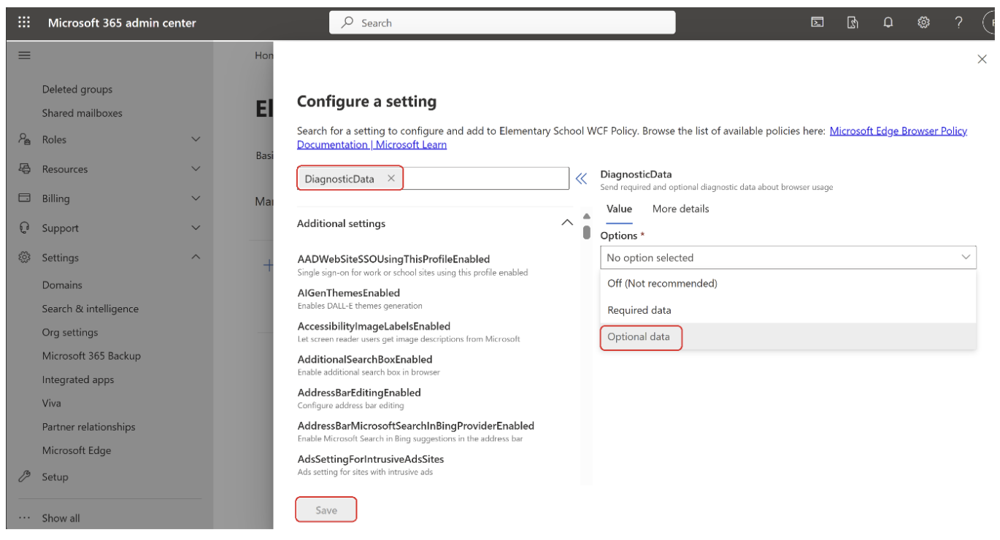
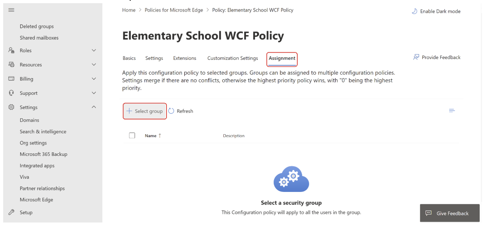

# Configure Web Content Filtering on Edge

This article describes how to configure Web Content Filtering (WCF) for Microsoft Edge.

## Introduction

Microsoft Edge is already one of the most secure browsers with features like phishing protection, typosquatting, and more to protect users when they're browsing online. Adding to these security features, Microsoft Edge is introducing Web Content Filtering (WCF) for EDU and SMB organizations to help them keep students and employees safe online. Using this feature, you can choose [categories of websites](edge-learnmore-wcf-supported-categories.md) that users are not allowed to access while using Microsoft Edge.

You can set up web content filtering for your organization via the Microsoft Edge management service using the  following steps. 

> [!NOTE]
> This experience is currently in preview.

## Prerequisites

Before you can set up WCF you must meet the following prerequisites.

1. On managed Windows devices where WCF policy needs to be applied:  
   - Be signed in with work or school account on a device running Windows 10 or later.
   - Have Microsoft Edge Version 135 or higher installed.
2. You must be a [Microsoft Edge Administrator](https://learn.microsoft.com/en-us/entra/identity/role-based-access-control/permissions-reference#edge-administrator) or a [Global Administrator](https://learn.microsoft.com/en-us/entra/identity/role-based-access-control/permissions-reference#global-administrator) to access this experience in Microsoft 365 Admin Center.
3. Your organization must have a M365 A1/A3/A5 license, Business Premium license, or Business Basic or Standard license with Intune Plan 1 or 2.

> [!NOTE]
> Make sure you update to the latest version of Edge  on all the managed devices where you want to run (WCF).

## Setup steps

This section describes and illustrates the steps for your organization:

- [Enable WCF for a configuration policy](#enable-wcf-for-a-configuration-policy)
- [Assign the WCF policy to a group](#assign-the-wcf-policy-to-a-group)
- [Manage exceptions via allow and block lists](#manage-exceptions-via-allow-and-block-lists)
- [Enable diagnostic data (optional)](#enable-diagnostic-data-optional)
- [Verify that the WCF policy was applied correctly](#verify-that-the-wcf-policy-was-applied-correctly)
- [Managing User Access Requests](#managing-user-access-requests)

### Enable WCF for a configuration policy

To enable WCF for a configuration policy:

1. From the Microsoft 365 admin center, navigate to Settings -> Microsoft Edge -> Configuration policies.

2. If you don’t yet have a configuration policy in the Edge management service assigned to your target. Microsoft Entra group, create one by following these steps: [Create a configuration policy.](https://learn.microsoft.com/en-us/deployedge/microsoft-edge-management-service#create-a-configuration-policy)

3. Navigate to your desired configuration policy by clicking on it. 

4. From the configuration policy, navigate to **Customization Settings -> Web content filtering**.

5. On the **Web content filtering** controls page, you’ll find all the settings to manage WCF for your organization. Under Blocked categories, check all the categories that you want to  block and then select **Save changes**. 

> [!IMPORTANT]
> Users with configured security settings may still be at risk on other browsers. To mitigate this risk, enabling web content filtering through the Edge management service also blocks user access to other browsers. When WCF is enabled, a new configuration policy will be created in Intune. Any modifications you make to this new policy in Intune or in a configuration policy with identical groups in the Microsoft Edge management service may lead to unexpected behaviors.

### Manage exceptions via allow and block lists

With the necessary categories blocked,  use the allow and blocklist capabilities to manage any exceptions.

If you want to allow a particular URL that is part of a blocked category, then you can add the URL to the list of Allowed Sites by following steps:

1. Under Web content filtering, select **Allowed Sites**.
2. Type in the URL of the site you want to allow and then select "**+**"
3. Select: **Save Changes**.

> [!TIP]
> Instead of adding the URLs manually, you can import them in bulk using a .csv or .json file with the **Import** option. You could also bulk export the list if you want to re-use it for a different group/policy. 

Similarly, if you want to block a particular URL or list of URLs, you can repeat the previous steps in the **Blocked sites** section.
 

> [!NOTE]
> In addition to specific URLs you can use URL patterns with supported wildcard characters. Refer to [this page](/DeployEdge/edge-learnmmore-url-list-filter%20format) for more information.

> [!IMPORTANT]
> URLs added to the Allowed sites list will take precedence over the Blocked sites list and Blocked categories. You can read more about this [here](/deployedge/microsoft-edge-policies#urlallowlist).

### Enable diagnostic data (optional)

Web Content Filtering (WCF) on Microsoft Edge is in preview and our aim is to make it as safe and seamless as possible. To help improve the feature and diagnose any issues that might arise during the preview, we recommend that you enable Optional data for the devices on which you are enabling WCF. Microsoft values your privacy, and we will not collect or use any personal identifiable information.

1. To enable **Diagnostic data**, open the policy configuration page and go to **Settings**.
2. Select **Add setting**.
  

3. Search for "DiagnosticData" and on the **Configure a setting** panel, under **Required data**, set the value to **Optional data**.
4. Select **Save**.
 

### Assign the WCF policy to a group

Now that the policy has WCF, Allowlist & Blocklist, and Diagnostic data settings configured you can assign this policy to a group. 

1. On the policy page, select Assignment and then select  Assignment. 

2. Click Select Group. 

### Verify that the WCF policy was applied correctly

You can check whether the policy was applied to a user's Edge browser by navigating to edge://settings/privacy. Under **Privacy, search, and services > Security** you should see the **Web content filtering** setting is enabled.
 
When a user tries to access a site that is blocked by WCF, they will see a screen like the one in the next screenshot.
 

> [!NOTE]
> It can take up to 90 minutes for policies set via the Edge management service be applied to user devices.

> [!TIP]
> If you have the same policy setup via Intune and EMX, Intune policy takes precedence by default. You can override this default behavior using the [EdgeManagementPolicyOverridesPlatformPolicy](/deployedge/microsoft-edge-policies#edgemanagementpolicyoverridesplatformpolicy) and the  [EdgeManagementUserPolicyOverridesCloudMachinePolicy](/deployedge/microsoft-edge-policies#edgemanagementuserpolicyoverridescloudmachinepolicy) settings in the browser policy documentation.

### Managing User Access Requests

If a user encounters a blocked site which they need to access for a legitimate business reason, or that they believe should not be blocked, they may request access. These requests can then be granted or denied by an administrator from the Edge management service.

> [!NOTE]  
> Requests are currently enabled for cloud-based configuration profiles.  
> Support for Intune-based configuration profiles is coming soon.  

URLs allowed via requests will automatically add the domain name to the allow list.

---

### Requesting Access (User Steps)

1. Access the blocked URL.
2. From the block page, click **Request access**.
3. In the request flyout, provide a justification in the text field.
4. Click **Send**.

---

### Managing Requests (Admin Steps)

1. From the **Web content filtering** page, click the **Requested sites** tab 
2. Under **Active requests**, click the domain name of the request that you wish to manage. 
3. Optional: You can view the justification message provided by a requestor by clicking the expand arrow next any of the listed request IDs. 
4. If you wish to leave the request blocked, leave the value of the **Allow site for all users** in this configuration policy? dropdown selection to No, block site. 
5. If you wish to allow the site, adjust the value of the dropdown to **Yes, allow site**. 
6. Click **Save**. 

To change a block or allow setting from a resolved request, remove the site from the appropriate block or allow list.

## See also

- [Microsoft Edge management service](/deployedge/microsoft-edge-management-service)
- [Microsoft Edge Enterprise landing page](https://aka.ms/EdgeEnterprise)